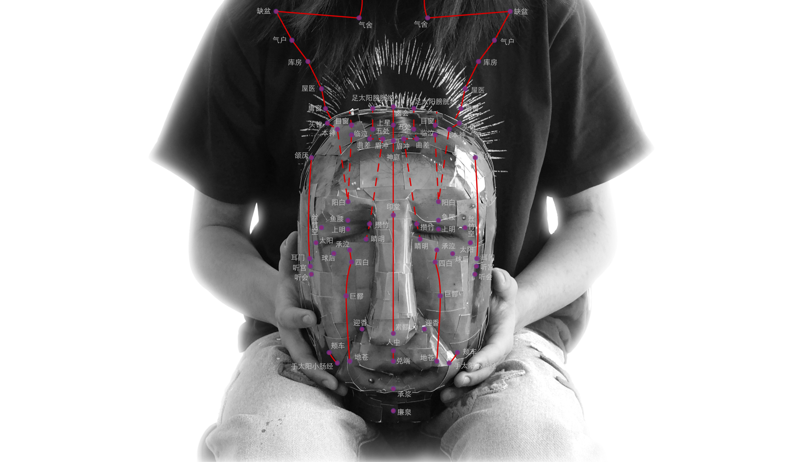

# Digital Acupuncture 🩻
## Discription 📄:
Susan Sontag once mentioned in her book On Photography that "photography is a supreme opportunity for self-expression." I believe the same applies to music. In this project, I created my personal music player, combining photography and music through acupuncture points on the human body to reflect a self-portrait. To me, both acupuncture in traditional Chinese medicine and music serve a similar purpose—they stimulate my nerves.

In this self-portrait, I’ve marked 75 acupuncture points on my body and face. Each point corresponds to a song I’ve selected from 75 different albums. Some of these songs play daily in my headphones, while others are rare memories from the past, heard only a few times but remaining significant. Together, these songs represent the shape of the sounds I enjoy.

I’ve always believed that the music someone enjoys is unique to them, reflecting their individuality, personality, aesthetics, personal experiences, and more. Through this website, you may not know who I am, but you will get a sense of my ear.
Feel free to click on any acupuncture point on my body to play a song, and I hope you, too, will discover sounds you like..

## Features 🪶 ：

## Additional Resources 📁：